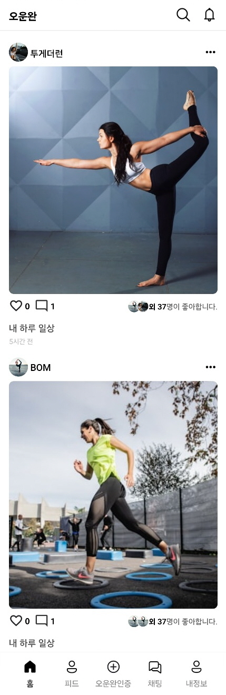
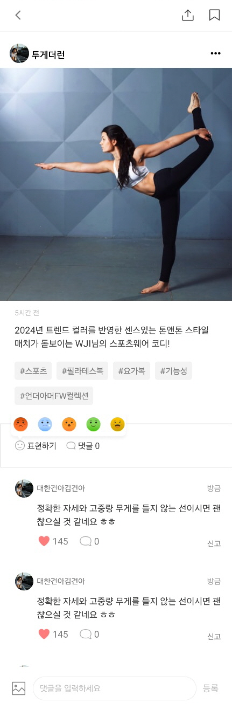
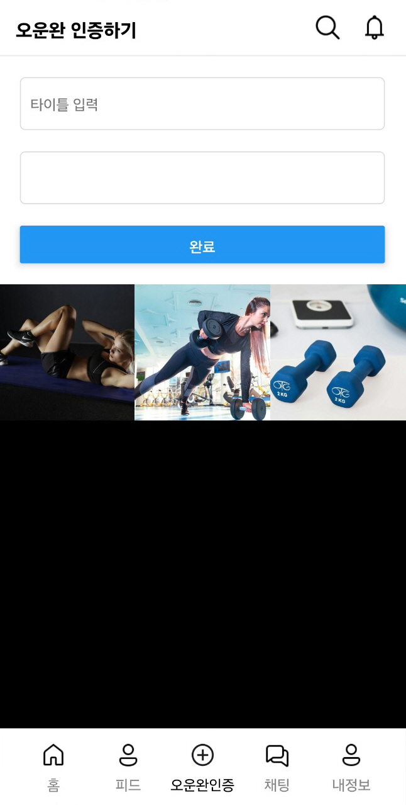
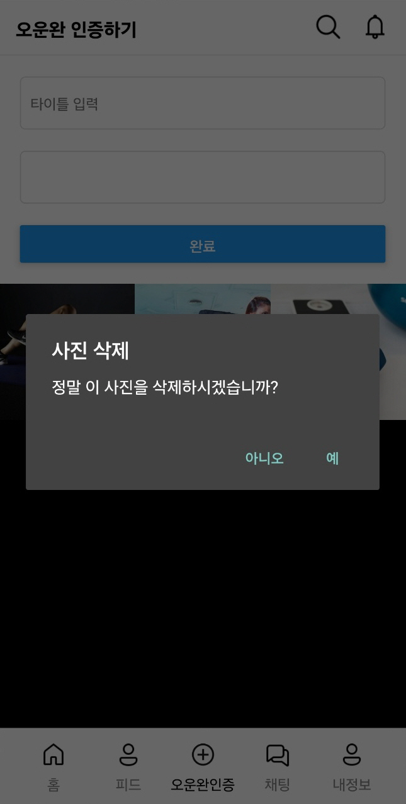
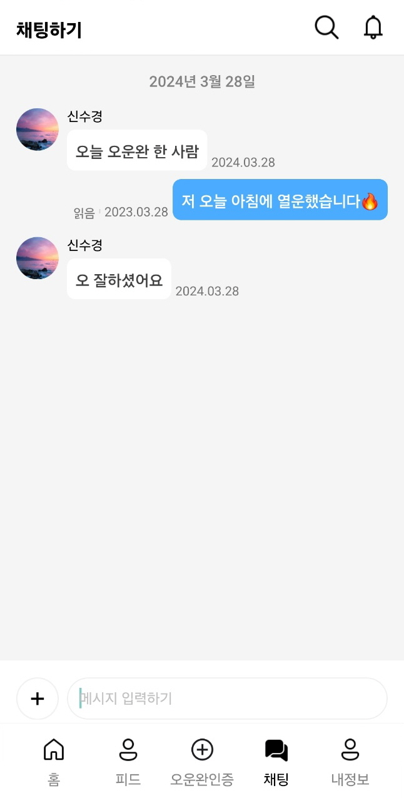
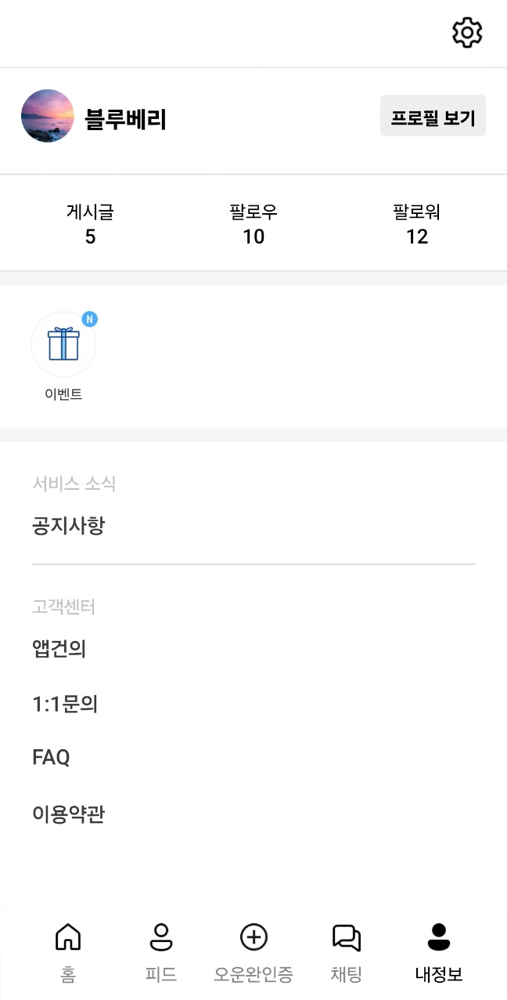
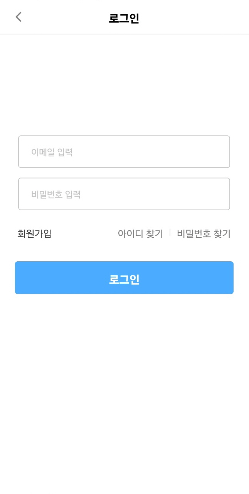
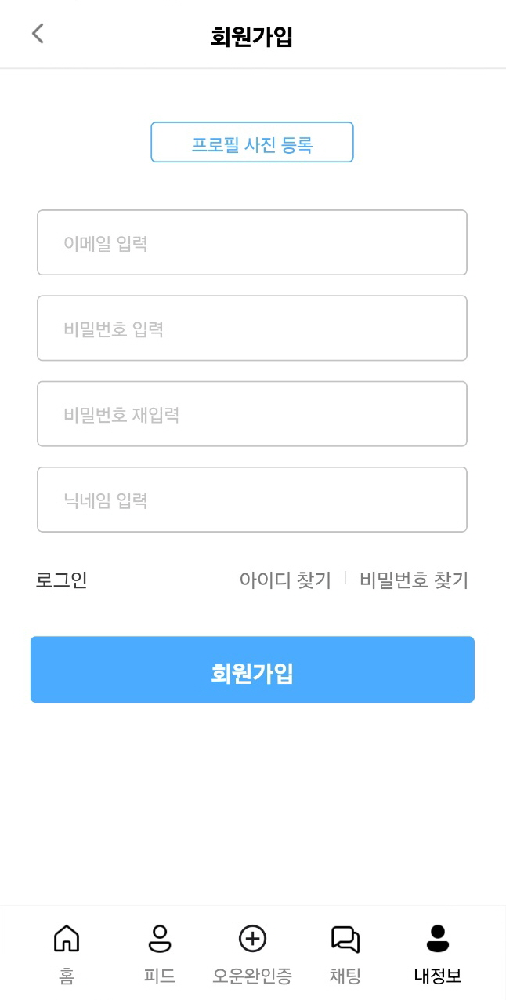
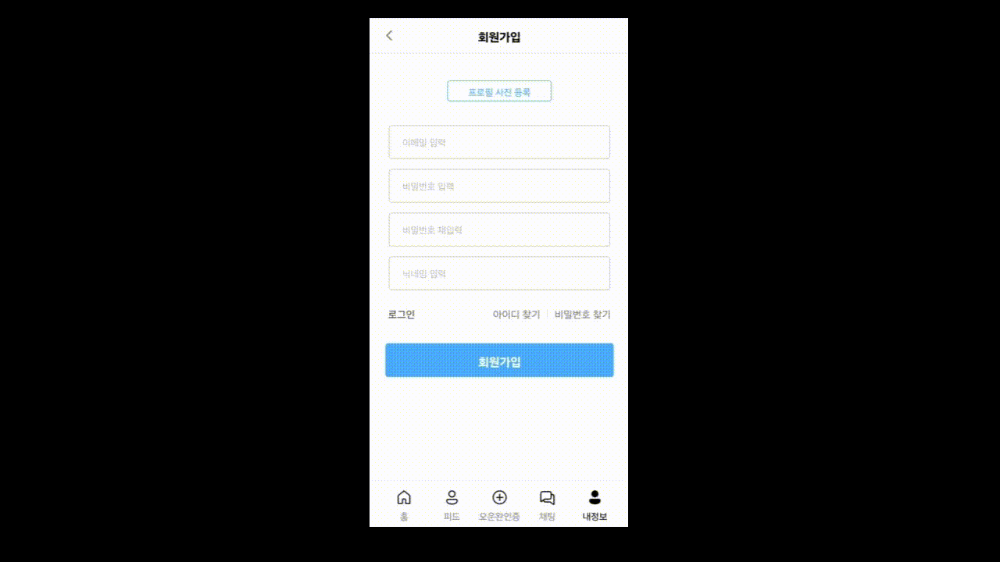
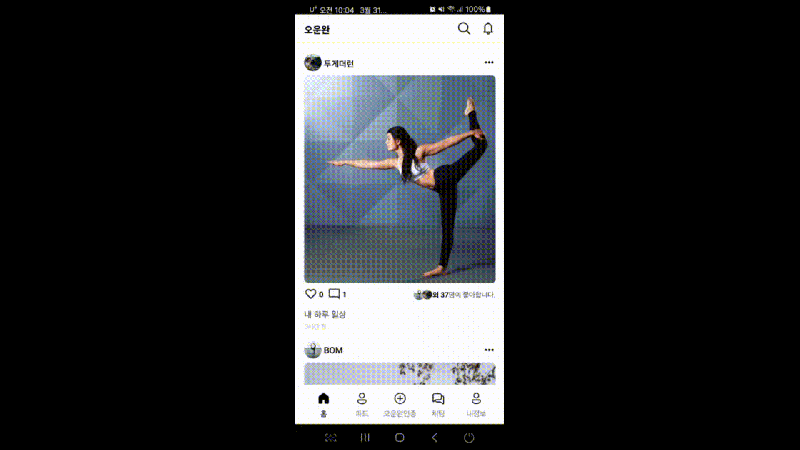

# 💫 Oh! unwan

### 💫 프로젝트 목표

- React Native를 이용해 오늘의 운동을 인증하는 SNS인 “오운완(오늘 운동 완료의 약자로, 운동을 완수한 후 인증을 남기는 용어 이하 오운완)” 앱을 구현하는데 목적

## 🔥 페이지별 화면

 

| 
홈
                                           | 
피드상세
                                         |
| ------------------------------------------------------------------ | ---------------------------------------------------------------------- |
| 

 | 

 |

| 
오운완인증추가
                               | 
오운완인증삭제
                                   |
| ------------------------------------------------------------------ | ---------------------------------------------------------------------- |
| 

 | 

 |

| 
채팅
                                         | 
설정
                                         |
| ------------------------------------------------------------------ | ------------------------------------------------------------------ |
| 

 | 

 |

| 
로그인
                                       | 
회원가입
                                     |
| ------------------------------------------------------------------ | ------------------------------------------------------------------ |
| 

 | 

 |

## 🔥 회원가입

| 

 |

## 🔥 comment 등록

| 

 |

## 🔥 오운완 등록 및 삭제

| 

 |
